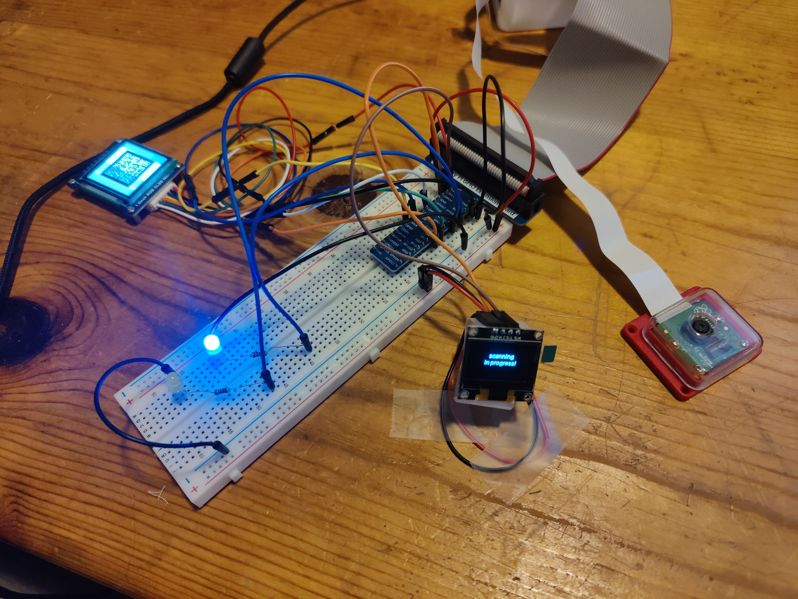
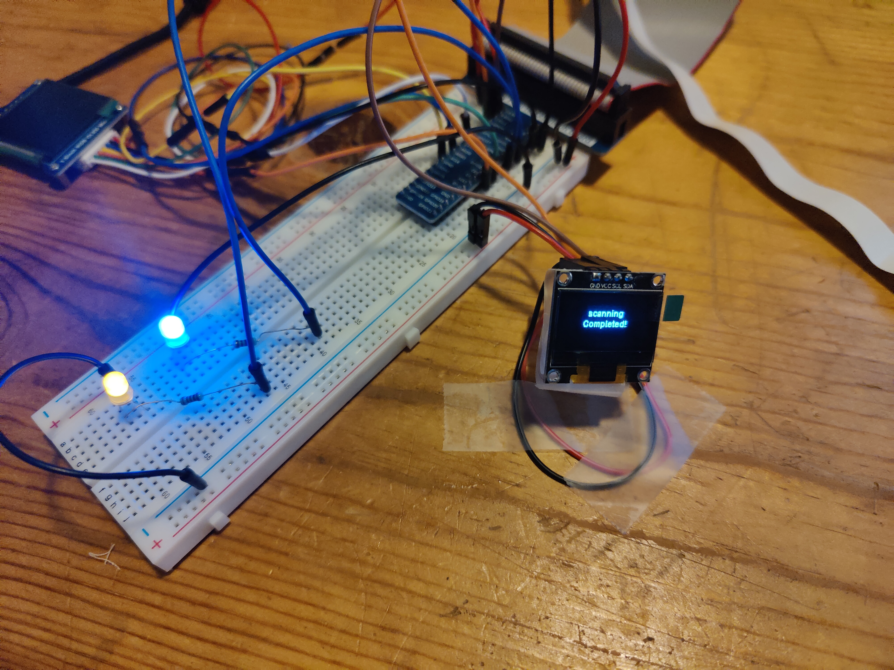

# This Project is Under development 🚧

## Streamlining Food Crate Tracking with Raspberry Pi

### Project Overview

This initiative addresses challenges faced by food distribution companies, like US Foods, in efficiently managing the return of food crates from customers. The proposed solution integrates Raspberry Pi technology into the distribution process. Each crate is assigned a QR code containing essential details such as customer information, delivery location, and city name.

To combat the common issue of lost crates, I designed an advanced tracking system. Each crate is equipped with a white plastic card containing an invisible QR code. As crates move along the conveyor belt, the QR code is scanned, updating with new data (vendor details, contents, and delivery information). When loaded onto trucks for delivery, the crates are scanned again, and the data is uploaded to AWS for analysis. Advanced analytics techniques provide actionable insights to enhance business processes.

### Motivation
The motivation behind this project is to streamline crate management processes and minimize financial losses resulting from unreturned crates. By leveraging Raspberry Pi's capabilities, the system provides a robust solution to track and manage the lifecycle of food crates.

### Components
The key components of the system include:
- **Raspberry Pi:** Serving as the core of the system, Raspberry Pi controls peripheral devices using GPIO pins, and Python is employed for coding.

- **Camera Module v2:** Captures high-resolution images of crate contents as they pass through the conveyor belt, ensuring accurate QR code generation.

- **OLED 1.5-inch Display:** Integrated into the system to display generated QR codes in real-time, providing visual confirmation.

- **LED Lights:** Used as indicators to signal the status of the QR code generation process, facilitating user-friendly feedback.

- **Web UI:** A user-friendly web interface accessible to authorized personnel, displaying data and insights gathered from QR codes.

### Workflow

- **QR Code Generation:** When the crate is on the conveyor belt, a QR code is generated by Raspberry Pi, containing crucial details.

- **SQS Queue Messaging:** The generated QR code message is sent to an SQS queue.

- **Web UI Interaction:** Authorized personnel can press a button on the web UI to display the QR code on the OLED display and trigger the scanning process.

- **QR Code Scanning:** Using the Camera Module v2, the system scans the QR code, and the data is sent to the SQS queue for processing.

- **CSV File Upload to S3:** The processed data is dumped into an S3 bucket as a CSV file.

- **Lambda Automation:** A Lambda function moves the CSV file from the raw to silver location and writes a message to the SQS queue for counting files uploaded.

- **Glue Job and Athena Integration:** If the SQS message count is greater than 10, an AWS Glue job is triggered to convert the CSV data to Parquet, loading it into an Athena table for real-time analysis.

- **Web UI Connectivity:** The web UI is connected to the Athena table, displaying delivered orders based on real-time data uploaded from Raspberry Pi.

### Environmental Sustainability
The system contributes to environmental sustainability by reducing paper usage through the efficient tracking and logging of crates' lifecycles.

### Feedback and Contributions
Feedback and contributions to enhance this project are highly welcomed. Feel free to share your suggestions or questions.

**Note:** Ensure that you have the necessary AWS credentials and configurations for the proper functioning of the system.

### Infrastructure Architecture

### DataLake Architecture

### Application Images

### Hardware Images

